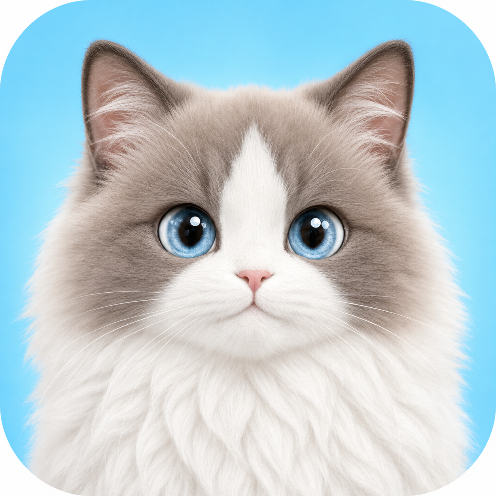
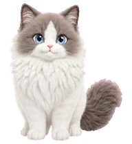
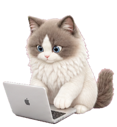

<p align="center">
  
</p>

<h1 align="center">Suannai Floating Pet / 酸奶悬浮宠物</h1>

<p align="center">
  <strong>A fluffy little coding companion for Codex.</strong><br />
  <strong>陪你和 Codex 一起工作的软萌小猫。</strong>
</p>

[English](#english) · [简体中文](#简体中文)

<p align="center">
  
  &nbsp;&nbsp;
  
  &nbsp;&nbsp;
  
</p>

## English

A native macOS floating desktop pet that keeps you company while you work with Codex. Suannai reacts to Codex activity, approval requests, and weekly usage, with draggable interactions, click animations, and adjustable sizing.

### Features

- Native AppKit/SwiftUI transparent always-on-top window
- Displays the remaining usage in Codex's 7-day window
- Random work animations, including typing, checking an iPhone, and drinking Coca-Cola
- Approval-request alerts and task-completion bubbles
- Grooming, sleeping, and exhausted idle states based on remaining usage
- Three click-interaction animations plus visual drag feedback
- Adjustable pet size from 75% to 150%, saved automatically

### Requirements

- Apple Silicon Mac
- macOS 14 or later
- Codex for macOS installed
- Xcode Command Line Tools

### Build and Run

```bash
chmod +x build-app.sh
./build-app.sh
open "build/酸奶悬浮宠物.app"
```

The built application will be available at `build/酸奶悬浮宠物.app`. The build script compiles directly with the system `swiftc` and does not modify your development environment.

### Privacy and Data

Suannai reads task activity and weekly usage from the local Codex app-server. It does not upload this data to any third-party service.

### License

The Swift source code and build scripts are available under the [MIT License](LICENSE). The cat character, animation frames, icons, and other visual assets are not covered by the MIT License. See [ASSETS-LICENSE.md](ASSETS-LICENSE.md) for details.

---

## 简体中文

一只会陪 Codex 工作的 macOS 原生悬浮桌宠。酸奶会根据 Codex 的工作状态、授权请求和周用量切换动作，也支持拖动、点击互动和大小调节。

### 功能

- 原生 AppKit/SwiftUI 透明置顶窗口
- 显示 Codex 7 天窗口的剩余用量
- 工作、玩手机、喝可口可乐等随机工作动画
- 授权请求提醒与任务完成气泡
- 根据剩余用量切换梳毛、睡觉和疲惫待机状态
- 三种点击互动动画与拖动反馈
- 75%–150% 宠物尺寸调节，并自动记忆设置

### 环境要求

- Apple Silicon Mac
- macOS 14 或更高版本
- 已安装 Codex macOS 应用
- Xcode Command Line Tools

### 构建与运行

```bash
chmod +x build-app.sh
./build-app.sh
open "build/酸奶悬浮宠物.app"
```

构建完成的应用位于 `build/酸奶悬浮宠物.app`。脚本使用系统 `swiftc` 直接编译，不会修改系统开发环境。

### 隐私与数据

酸奶通过本机 Codex app-server 获取任务状态和周用量，不会把这些数据上传到任何第三方服务。

### 许可证

Swift 源码与构建脚本采用 [MIT License](LICENSE)。猫咪形象、动画帧、图标及其他视觉素材不包含在 MIT 授权范围内，详见 [ASSETS-LICENSE.md](ASSETS-LICENSE.md)。
